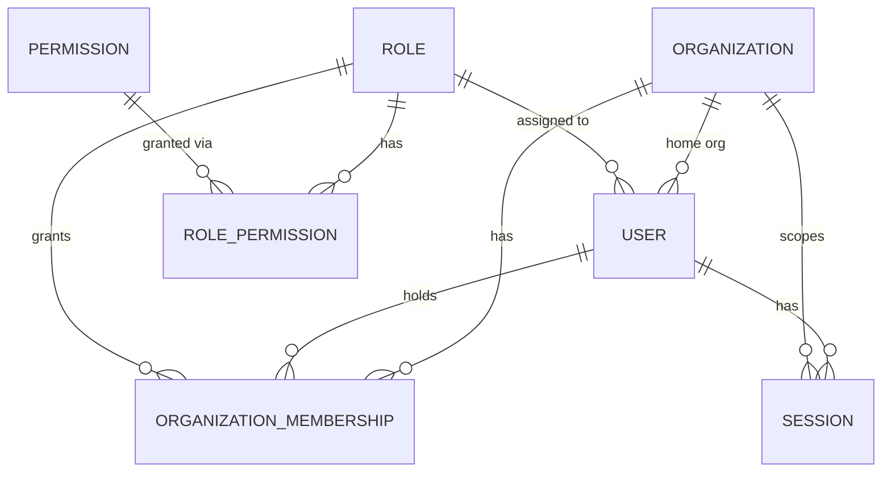
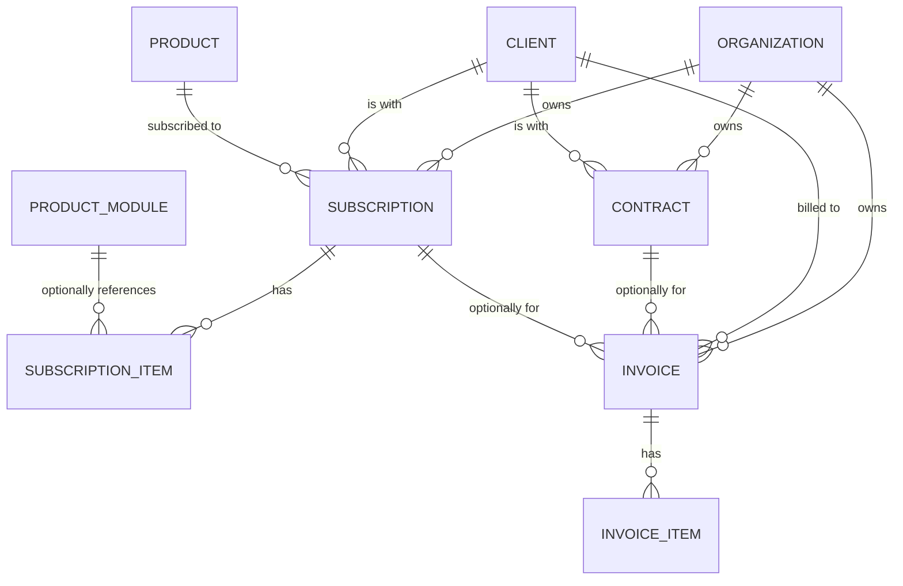
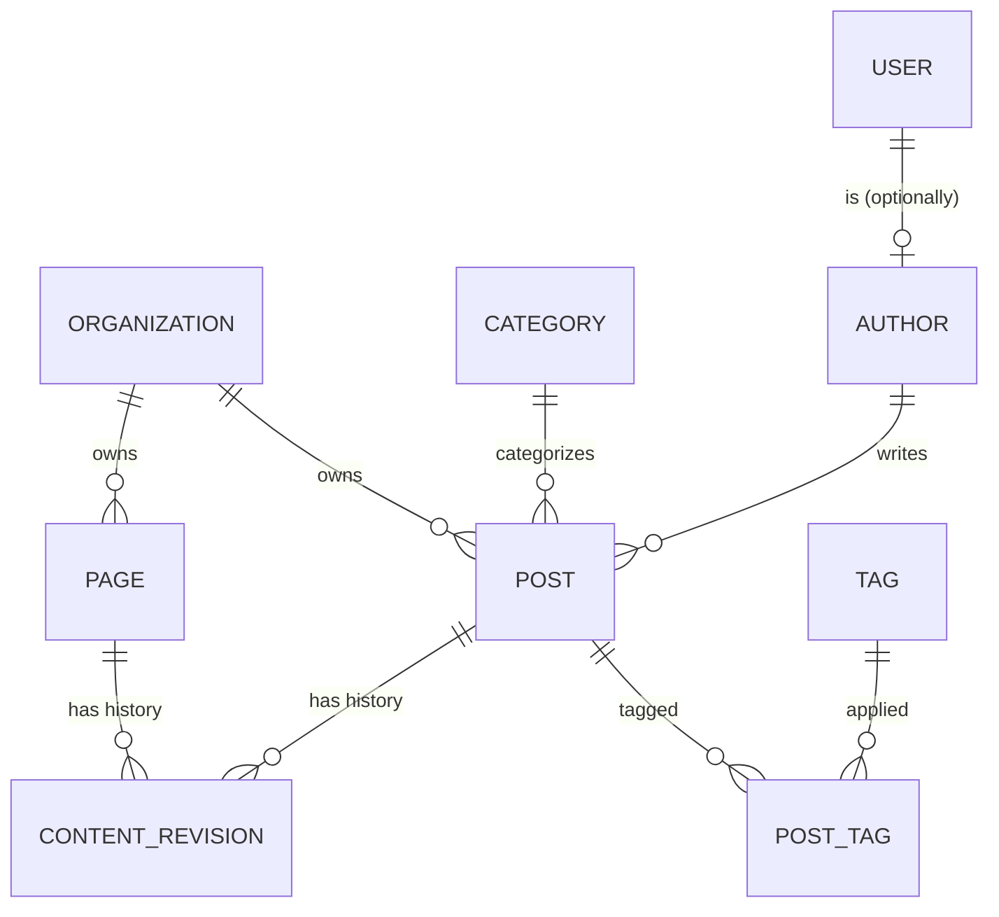

# Database Schema — Phase 2 Core Data Model

The as-implemented schema (`prisma/schema.prisma`, migration `20260920000001_phase2_core_data_model`). For the target-state recommendation this implements, see `docs/DATABASE_DESIGN.md`; for the decisions behind specific choices, see the ADRs referenced throughout.

30 application tables across 9 domains (31 relations in the schema including Prisma's own `_prisma_migrations` bookkeeping table — verified via `psql \dt` against a clean local Postgres). Every table's full column list is in `prisma/schema.prisma` itself (the schema file is the source of truth); this document explains relationships, constraints, and the *why* that doesn't fit in a column list.

## Domain map

```
Identity        organizations, users, organization_memberships, roles, permissions, role_permissions, sessions
Security        audit_logs, webhook_events
CRM             leads, clients, contacts
Products        products, product_modules
Commercial      contracts, subscriptions, subscription_items, invoices, invoice_items
CMS             pages, posts, categories, tags, authors, content_revisions, post_tags
Media           media_assets
Notifications   notifications, notification_preferences
Configuration   system_settings
```

## Tenant boundary

Every tenant-owned table carries an explicit `organization_id` (or, for `content_revisions`/`post_tags`/`subscription_items`/`invoice_items`, is transitively scoped through its immediate parent). `organization_id` means **the organization that owns/manages this record** — for CRM, Commercial, and CMS tables that's a fixed convention worth stating plainly: it is *not* a pointer to "the customer's own company profile." A `Lead`'s prospective company is inline text (`company_name`) because they aren't a platform tenant yet; a `Contract`/`Subscription`/`Invoice`'s actual counterparty is `client_id` (→ `clients`), a *separate* field from `organization_id`. See `ADR-010` for the full reasoning and `docs/AUTHORIZATION_MODEL.md` for how this scope is enforced server-side (never client-side, never `WHERE id = ?` alone — `tests/security/rbacAndAudit.test.ts`'s tenant-isolation test proves the query pattern).

## ID / timestamp / naming conventions
- **IDs**: UUID v4, `id String @id @default(uuid())` on every table. (`ADR-002`'s v7 recommendation not yet adopted — low-risk follow-up, noted in `docs/DATABASE_DESIGN.md`.)
- **Naming**: PostgreSQL columns/tables are `snake_case` (via `@map`/`@@map`); the Prisma client exposes `camelCase` to TypeScript. No mixed-case column ever reaches the database.
- **Timestamps vs. dates**: `created_at`/`updated_at`/`deleted_at`/`published_at`/`expires_at`/etc. are `TIMESTAMP(3)` (event moments, timezone-naive but always written/read in UTC by convention — the app never sets a local offset). `start_date`/`end_date`/`issue_date`/`due_date` on `Contract`/`Subscription`/`Invoice` are `@db.Date` — pure calendar dates, deliberately distinct from timestamps per Phase 2 §10, because "a contract starts on 2026-01-01" is a date fact independent of any timezone, not a moment in time.
- **Money**: `NUMERIC(18,3)` via Prisma `Decimal`, currency as an explicit `CHAR(3)` column on every monetary row — see `ADR-012`.

## Identity



- **organizations**: the tenant registry — Artify's own entity (`type=INTERNAL`) and every client organization are rows here (`ADR-010`). `slug` unique globally; soft-deletable (`deleted_at`).
- **users**: global email uniqueness (`ADR-010`); `organization_id` is the home org, `role_id` the single assigned role. `password_hash` is bcrypt (never SHA-256 — Phase 0/1 finding S5/R5). Account lockout fields (`failed_login_attempts`, `locked_until`) from Phase 1, unchanged.
- **organization_memberships**: the real multi-org model, unique on `(user_id, organization_id)` — see `ADR-010` for what's wired up today vs. deferred to Phase 3.
- **roles** / **permissions** / **role_permissions**: the RBAC schema — see `ADR-011` for the full design and the 5 seeded roles.
- **sessions**: `token_hash` (unique), never the raw bearer token — see `ADR-011`'s session addendum.

## Security

- **audit_logs**: append-only by convention (`auditLogRepository` exposes exactly one method, `record` — `tests/security/rbacAndAudit.test.ts` asserts this). `actor_user_id` is `SET NULL` on user deletion — deleting a user must never destroy audit history (§38/§46, tested). `before_data`/`after_data`/`metadata` are JSONB for flexible mutation context; sensitive values (passwords, tokens, secrets) must never be placed in these columns — enforced by code review discipline today, not a database constraint (a database-level redaction guarantee isn't practical for a JSONB payload).
- **webhook_events**: idempotency/signature-verification trail, unchanged from Phase 1 (`docs/SECURITY_MODEL.md`).

## CRM

- **leads**: `organization_id` = owning tenant; the prospect's own identity is inline (`company_name`, `contact_name`, `email`, `phone`) since they don't have an `organizations` row yet. `status` is a controlled enum (`NEW`/`CONTACTED`/`QUALIFIED`/`CONVERTED`/`LOST`), not a free string.
- **clients**: `organization_id` = owning tenant; `client_code` unique **per tenant** (`(organization_id, client_code)`), not globally — two different Artify-platform tenants could reasonably reuse a code.
- **contacts**: a person, kept separate from `clients` so one client can have several contacts without duplicating contact data (§25). `client_id` is nullable — a contact can exist before a formal client relationship does.

## Products

- **products**: the registry for current *and future* Artify products (HCMS, Payroll, Accounting, CRM, ERP) — `code` unique globally, `configuration` JSONB for product-specific settings. No product's business logic lives in this schema; only its registration.
- **product_modules**: lets a product register sub-modules (e.g. HCMS → Employee Management, Attendance, Payroll) without a schema redesign per product — `unique(product_id, code)`.

## Commercial



- **contracts** / **subscriptions** / **invoices**: each carries both `organization_id` (owning tenant) and `client_id` (the actual counterparty, FK → `clients`) — the `contracts` field list in the brief lists both explicitly, which is the pattern this schema applies consistently across all three Commercial tables.
- **Historical integrity (§21/§46)**: none of `contracts`/`subscriptions`/`invoices` are soft-deletable. Their lifecycle is tracked via `status` (`TERMINATED`, `CANCELLED`/`EXPIRED`, `VOID` respectively) — a contract, subscription, or invoice's existence is a fact of record that a delete-flag must never hide.
- **Financial precision**: `ADR-012` in full. Verified by `tests/integration/schemaConstraints.test.ts`'s exact-decimal test (`1000.125` round-trips losslessly) and its negative-value/date-ordering `CHECK`-constraint tests.
- **Date-range sanity**: `CHECK` constraints ensure `end_date >= start_date` (contracts, subscriptions) and `due_date >= issue_date` (invoices) — hand-added to the migration (Prisma's DSL has no native `CHECK` syntax), tested.

## CMS



- **content_revisions**: one shared table for both `pages` and `posts` (not one per content type) — real FK integrity is kept (no polymorphic FK) via nullable `page_id`/`post_id` plus a `CHECK (num_nonnulls(page_id, post_id) = 1)` constraint, hand-added to the migration and tested (`schemaConstraints.test.ts`'s "exactly one parent" test). `pages.current_revision_id`/`posts.current_revision_id` point back at the live revision, creating a two-table cycle that `tests/helpers/db.ts`'s `resetDb()` explicitly breaks (nulling the pointer before deleting) — a real structural detail worth knowing before writing any future migration touching these tables.
- **Immutability**: a revision is not updated after `status=PUBLISHED` — enforced at the application layer (no update-after-publish service method exists; none is built yet in Phase 2 since no CMS service layer exists yet either — this is a design commitment for Phase 8, not yet an enforced invariant with code behind it).
- **authors**: a thin public-facing profile over a `User` (bio/avatar) — every author is a user, not every user is an author (`unique(user_id)`).

## Media

- **media_assets**: metadata and a `storage_key` reference only — no file bytes in Postgres (§33, Phase 9 owns actual object storage). Soft-deletable.

## Notifications

- **notifications** / **notification_preferences**: minimal foundation, no dispatch engine (§34, Phase 13). `notifications.organization_id` is nullable (a platform-wide notification isn't necessarily tied to one org); `user_id` is not (every notification has exactly one recipient).

## Configuration

- **system_settings**: `organization_id` is **always set** (`NOT NULL`) — "global" settings are simply the settings owned by Artify's own `type=INTERNAL` organization. This sidesteps the classic nullable-organization-scope uniqueness problem (Postgres treats multiple `NULL`s in a unique index as distinct, which would silently allow duplicate "global" keys) without needing a partial index. `unique(organization_id, key)`.

## Deletion policy summary

| Pattern | Applies to | Rationale |
|---|---|---|
| Soft delete (`deleted_at`) | organizations, users, leads, clients, contacts, pages, posts, media_assets | Reversible removal; audit/RBAC history referencing these rows stays intact. |
| Status-tracked, no soft delete | contracts, subscriptions, invoices | Historical/financial records — existence is a fact, not reversible (§21/§46). |
| Hard delete only (no `deleted_at`) | organization_memberships, sessions, audit_logs*, webhook_events, role_permissions, notifications | Either pure relationship/join rows (memberships, role_permissions) or naturally ephemeral/append-only records (sessions expire; audit_logs are append-only *by convention*, not by omitting a delete flag — see below). |

\* `audit_logs` has no `deleted_at` and no update/delete repository method — its "no soft delete" is really "no delete path at all" through the application. A database-role-level `REVOKE UPDATE, DELETE` grant (so not even a raw SQL bypass could alter history) remains a Phase 16 deployment-hardening step, not yet applied.

**FK deletion behavior**, by category (`ADR-010`, `docs/AUTHORIZATION_MODEL.md`):
- `RESTRICT` on every tenant-scope `organization_id` FK and every `client_id` FK on Commercial tables — an organization or client can never be hard-deleted while business records reference it.
- `SET NULL` on "soft" references where the parent's own deletion should not cascade (e.g. `audit_logs.actor_user_id`, `leads.assigned_to`, `invoices.contract_id`).
- `CASCADE` only for pure structural/relationship rows with no independent meaning (`organization_memberships`, `sessions`, `role_permissions`, `subscription_items`, `invoice_items`, `post_tags`, `content_revisions` on their parent page/post).

## Indexes

Every `organization_id` FK is indexed (the single most common query filter in a multi-tenant schema). Additional indexes: `users.email` (unique, login lookups), `sessions.token_hash` (unique, per-request auth check) + `sessions.expires_at`, `audit_logs.(organization_id, actor_user_id, created_at)`, `leads.(organization_id, status)`, `permissions.module`. See `prisma/schema.prisma`'s `@@index`/`@@unique` annotations for the exhaustive, authoritative list — this section calls out the ones worth understanding *why*, not a duplicate of the schema file.
