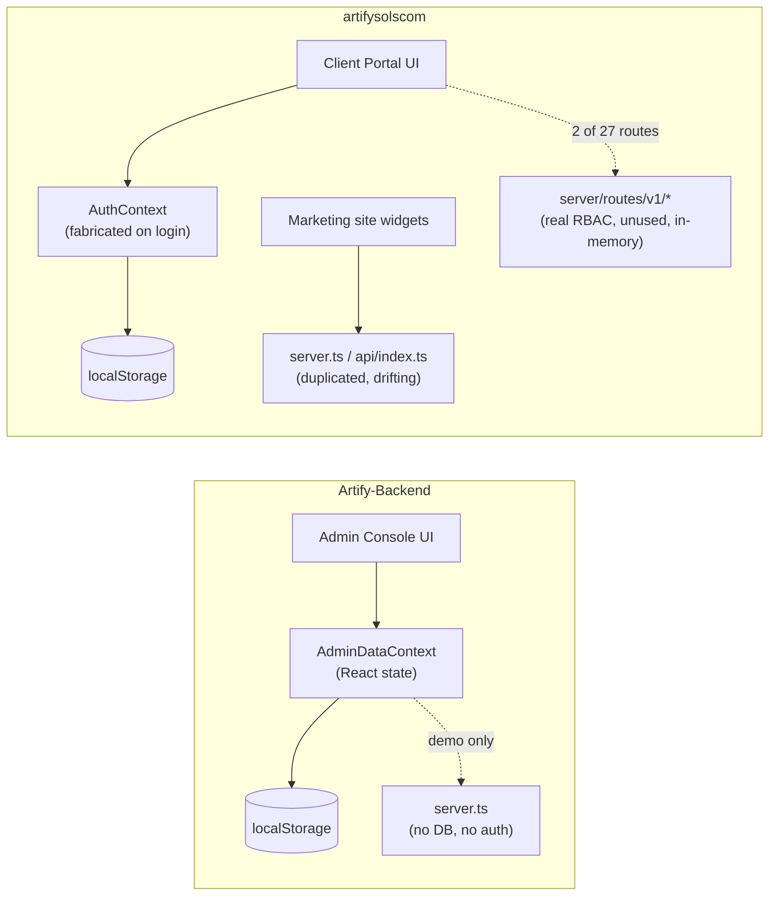
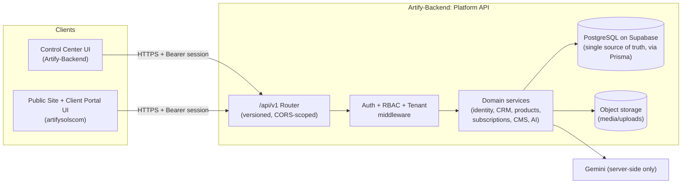

# Target Production Architecture

> **Phase 2 update**: the `repositories/*` layer described as "new" in §4 below is now real (Prisma against PostgreSQL/Supabase — `ADR-008`, `ADR-009`), and `companies` is now `organizations` with a real `organization_memberships` join table (§6's "same `companies`/`users`/`audit_logs` tables" line is superseded — read `organizations`; `ADR-010`). Schema for CRM/Products/Commercial/CMS/Media/Notifications/Configuration now exists (`docs/DATABASE_SCHEMA.md`), but most of those domains still have no `services/*`/`routes/v1/*` layer yet — only Identity + system health are wired end-to-end. See `docs/PHASE_2_COMPLETION_REPORT.md`.
>
> **Phase 1 update**: the identity + webhook slice of §2's target flow is implemented — see `docs/PHASE_1_COMPLETION_REPORT.md`.

## 1. Principle

**One authoritative Platform API. Two consuming frontends.** Neither frontend maintains its own data source ever again.

```
Artify-Backend  =  Platform API (Node/Express + PostgreSQL)  +  Control Center UI (React)
artifysolscom   =  Public Website + Client Portal UI (React)  →  consumes Platform API only
```

`Artify-Backend`'s existing `server/` code layer (see `CURRENT_STATE.md` §2.2/§2.4) already has the right shape — routers → services → typed models, an `authService` with RBAC/tenant middleware, a standard response envelope (`server/core/apiResponse.ts`) — but currently lives in the *wrong repository* (`artifysolscom`) and sits on an in-memory, non-persistent store. Phase 1 relocates and hardens that layer into `Artify-Backend`; it is not rebuilt from scratch.

## 2. Current vs. target data flow

**Current (as verified in `CURRENT_STATE.md`):**


**Target:**


## 3. Why `Artify-Backend`, not `artifysolscom`, is the platform of record

See `ADR/ADR-001-platform-boundary.md`. Summary: the brief itself designates `Artify-Backend` as the future Control Center/Admin Platform and states the public site "must not maintain an independent competing database." `artifysolscom` already has more real backend code than `Artify-Backend` does today (§2 above) — that code must move, not be duplicated again.

## 4. Layering (within the Platform API)

```
routes/v1/*        → HTTP concerns only: parse, call service, format envelope
services/*          → business rules, validation, orchestration, audit-log writes
repositories/*       → Prisma queries only (implemented Phase 1-2 for Identity; other domains have schema but no repository/service yet)
db (PostgreSQL on Supabase, via Prisma)      → source of truth
```

The explicit repository layer is now real for the Identity domain (`server/repositories/*` — `userRepository`, `organizationRepository`, `roleRepository`, `sessionRepository`, `auditLogRepository`, `webhookEventRepository`) — it's what made swapping the in-memory `Map`s for real SQL tractable without rewriting every service. CRM/Products/Commercial/CMS/Media/Notifications/Configuration have Prisma models (`docs/DATABASE_SCHEMA.md`) but no repository/service/route layer yet — building those out is future-phase work, not done speculatively now (Phase 2 brief §64 "do not overbuild").

## 5. Cross-cutting concerns every route must get (none exist today)
CORS allow-list (Control Center origin + artifysolscom origin only), rate limiting, request-size limits, structured request logging with the existing `requestId` (already generated in `apiResponse.ts`, just never logged), centralized Express error-handler middleware, Helmet-equivalent security headers (a subset already exists in `artifysolscom/server.ts:27-32` — reuse and extend it), input validation (zod) at the route boundary before it reaches services.

## 6. Multi-product extensibility

Future Artify products (HCMS, Payroll, Accounting, CRM, ERP) reuse the platform's identity, organization, billing, and audit primitives rather than re-implementing them — each new product is a new set of `services/` + `routes/v1/<product>` modules against the same `organizations`/`users`/`audit_logs` tables (`ADR-010`), plus a `products`/`product_modules` registry row identifying it (`docs/DATABASE_SCHEMA.md`), not a new backend. This is why identity/org/billing/audit are modeled first (Phase 1-2, now implemented) before any product-specific service logic.
